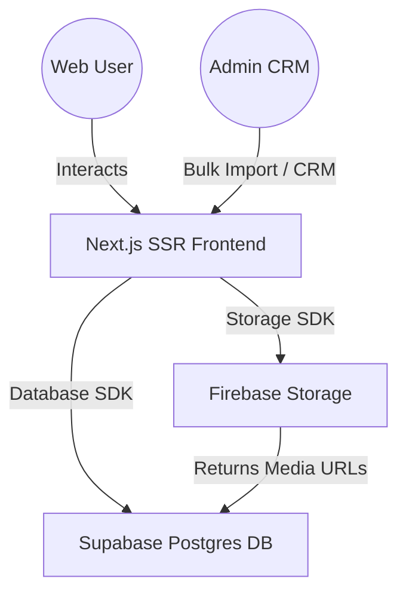

# 🫙 Ramakrishna Foods (రామకృష్ణ ఫుడ్స్) E-commerce Platform

**Ramakrishna Foods (రామకృష్ణ ఫుడ్స్)** is an elite, heritage-first culinary brand dedicated to delivering traditional Telugu pickles, condiments, and premium sweets. This repository contains the source code for the digital flagship platform bridging generations of pure taste and household trust with high-performance e-commerce architecture.

Designed to make users "taste" the products within three seconds of landing on the site, the platform utilizes high-contrast visual engineering, localized Telugu script, and intuitive micro-interactions.

---

## 🎨 Visual Identity & Brand Canvas

The design system is explicitly derived from the brand’s authentic Telugu visual assets, moving away from generic templates to establish a premium, high-contrast aesthetic:

| Color Accent | Hex Value | Represents / Cultural Reference |
| :--- | :--- | :--- |
| **Primary Deep Terracotta Red** | `#8B261E` | Traditional Indian earthenware pots (*kunda*) used for slow-fermenting and storing pickles. |
| **Secondary Warm Ochre** | `#E5A93C` | Cold-pressed oils, freshly ground turmeric, and sun-dried mustard seeds. |
| **Background Matte Charcoal** | `#121212` | High-contrast canvas, making the bright colors of food photography pop dramatically. |
| **Neutral Warm Cream** | `#FAF9F6` | Readable text bodies, localized headings, and structural panels. |

---

## 📦 Features

### 1. Traditional Telugu Catalog (ఆంధ్రా & తెలంగాణ పచ్చళ్ళు)
* **Signature Pickles:** Chunks of raw green Avakaya (Mango), tangy Nimma (Lemon), sun-dried Magaya (Dried Mango), savory Karivepaku (Curry Leaf), and acidic Kuvevaku (Gongura).
* **Premium Sweets:** Wafer-thin Atreyapuram Pootharekulu, golden Nethi Ariselu, velvety Bandar Laddu, chewy Madugula Halwa, cardamom-scented Pala Thalikalu, and filled Pala Munjalu.
* **Dietary Filtering:** Robust categorization supporting Veg & Non-Veg toggles for meals and pickles.

### 2. "Spice & Sweetness" Heat Slider
* An interactive, animated flavor intensity indicator on product pages. For pickles, the scale runs from *Mellow* to *Authentic Telugu* to *Fiery Guntur*. For sweets, it measures rich indulgence.
* Implemented in: [HeatSlider.tsx](file:///c:/website/rkfoods/frontend/src/components/HeatSlider.tsx)

### 3. "Build Your Heritage Box" Sampler Module
* A drag-and-drop interface for customizing physical multi-packs. Customers drag three or four miniature jars into a virtual cardboard gift box, with the price and bundle weight updating dynamically.
* Implemented in: [HeritageBoxSampler.tsx](file:///c:/website/rkfoods/frontend/src/components/HeritageBoxSampler.tsx)

### 4. Direct-to-Cloud User Reviews
* Customers can upload unboxing photos (`.jpg`), tasting videos (`.mp4`), or audio feedback (`.mp3`). The frontend utilizes the Firebase Storage SDK to stream these files directly to Firebase Storage, saving server resources and recording secure HTTPS URLs in the database.
* Implemented in: [ReviewSection.tsx](file:///c:/website/rkfoods/frontend/src/components/ReviewSection.tsx)

### 5. Onboarding "User Agreement Lock"
* Protects B2B client project logs with a modal lock. If a client's status is "Pending", they are blocked from logs until they scroll through and sign the Master Services & User Agreement.
* Implemented in: [B2B Portal](file:///c:/website/rkfoods/frontend/src/app/b2b/page.tsx)

### 6. Admin CRM Dashboard
* Product management (adding inventory, generating sequential IDs, pricing, availability checking).
* Bulk product catalog imports from `.xlsx` (Excel) and `.docx` (Word) formats.
* Deliverable location management.
* Implemented in: [Admin Panel](file:///c:/website/rkfoods/frontend/src/app/admin/page.tsx)

---

## 🛠️ Architecture & Tech Stack

This project is organized as a unified monorepo divided into frontend modules and cloud database configurations:



* **Frontend Framework:** Next.js (SSR for high SEO indexing on regional terms) & Tailwind CSS
* **Media Cloud Storage:** Firebase Storage
* **Primary Relational Database:** Supabase (PostgreSQL)
* **Hosting Platform:** Vercel

---

## 📂 Project Structure & Key Files

* **[/frontend](file:///c:/website/rkfoods/frontend/)** — Core Next.js Application
  * **[package.json](file:///c:/website/rkfoods/frontend/package.json)** — Core frontend dependencies
  * **[src/app/](file:///c:/website/rkfoods/frontend/src/app/)** — NextJS App Router Pages
    * [page.tsx](file:///c:/website/rkfoods/frontend/src/app/page.tsx) — Main landing page & video hero
    * [admin/](file:///c:/website/rkfoods/frontend/src/app/admin/) — Admin Dashboard & Bulk Importer
    * [b2b/](file:///c:/website/rkfoods/frontend/src/app/b2b/) — B2B User Agreement Lock
    * [checkout/](file:///c:/website/rkfoods/frontend/src/app/checkout/) — Checkout Flow & User Details Form
    * [sampler/](file:///c:/website/rkfoods/frontend/src/app/sampler/) — Sampler Box customization
  * **[src/components/](file:///c:/website/rkfoods/frontend/src/components/)** — Shared React Components
    * [HeroVideo.tsx](file:///c:/website/rkfoods/frontend/src/components/HeroVideo.tsx) — Cinematic Video Hero Banner
    * [Navbar.tsx](file:///c:/website/rkfoods/frontend/src/components/Navbar.tsx) — Styled navigation bar with Chili-R brand mark
    * [Footer.tsx](file:///c:/website/rkfoods/frontend/src/components/Footer.tsx) — Footer with hotlinks & Phone ordering
  * **[src/lib/](file:///c:/website/rkfoods/frontend/src/lib/)** — Helper Libraries
    * [firebase.ts](file:///c:/website/rkfoods/frontend/src/lib/firebase.ts) — Firebase Client SDK Initializer
    * [supabase.ts](file:///c:/website/rkfoods/frontend/src/lib/supabase.ts) — Supabase DB Client Initializer
    * [products.ts](file:///c:/website/rkfoods/frontend/src/lib/products.ts) — Product fetching & Mock fallback data
    * [env.ts](file:///c:/website/rkfoods/frontend/src/lib/env.ts) — Environment Variable Validator
* **Root Configuration Files**
  * **[supabase_schema.sql](file:///c:/website/rkfoods/supabase_schema.sql)** — PostgreSQL database tables and seeds
  * **[firestore.rules](file:///c:/website/rkfoods/firestore.rules)** — Firestore Security Rules
  * **[storage.rules](file:///c:/website/rkfoods/storage.rules)** — Firebase Storage Security Rules
  * **[firebase.json](file:///c:/website/rkfoods/firebase.json)** — Firebase Hosting and CLI setup

---

## 💾 Database Schema

The database schema is defined in [supabase_schema.sql](file:///c:/website/rkfoods/supabase_schema.sql) and contains the following relational structure:

### 1. `profiles`
Tracks user credentials, display names, phone numbers, and administrative authorization roles (`customer` or `admin`).

### 2. `products`
Stores product meta-information:
* `sku` (e.g. `RKF260601`) — Unique alphanumeric SKU identifier.
* `name` & `name_telugu_script` (e.g. `అవకాయ`).
* `category` — `pickles`, `sweets`, or `meals`.
* `diet_type` — `veg` or `nonveg`.
* `actual_price` & `selling_price` — Used for markdown calculations.
* `heat_level` (1 to 10) — Indicates spice/sweetness level.

### 3. `locations`
Stores delivery eligibility markers (City, State, Pincode) used in checkout address verification.

### 4. `orders`
Tracks customer purchases, including detailed line items, total amounts, shipping address details, and tracking statuses.

### 5. `reviews`
Stores client review posts and links to media (photo, video, and audio) uploaded to Firebase Storage.

### 6. `b2b_sessions` & `project_logs`
Tracks enterprise customer states (`Pending`/`Active`) and developer progress logs.

---

## 🚀 Getting Started & Local Development

### 1. Prerequisites
Ensure you have Node.js (v18+) and npm/yarn installed on your machine.

### 2. Configure Environment Variables
Inside the `frontend` directory, create a `.env.local` file by copying the example values:

```bash
NEXT_PUBLIC_FIREBASE_API_KEY="your-api-key"
NEXT_PUBLIC_FIREBASE_AUTH_DOMAIN="your-auth-domain"
NEXT_PUBLIC_FIREBASE_PROJECT_ID="your-project-id"
NEXT_PUBLIC_FIREBASE_STORAGE_BUCKET="your-storage-bucket"
NEXT_PUBLIC_FIREBASE_MESSAGING_SENDER_ID="your-sender-id"
NEXT_PUBLIC_FIREBASE_APP_ID="your-app-id"
NEXT_PUBLIC_FIREBASE_MEASUREMENT_ID="your-measurement-id"

NEXT_PUBLIC_SUPABASE_URL="your-supabase-url"
NEXT_PUBLIC_SUPABASE_ANON_KEY="your-supabase-anon-key"
```

### 3. Install & Start the App

```bash
# Navigate to the frontend directory
cd frontend

# Install project dependencies
npm install

# Run the local development server
npm run dev
```

Open [http://localhost:3000](http://localhost:3000) in your browser to view the application.

### 4. Database Setup
Apply [supabase_schema.sql](file:///c:/website/rkfoods/supabase_schema.sql) directly in your Supabase SQL Editor to seed the default products, locations, and B2B configurations.

---

> [!NOTE]
> All user review videos, audio, and images are uploaded directly to Firebase Storage. Ensure that the [storage.rules](file:///c:/website/rkfoods/storage.rules) are deployed to permit write access under `images/`, `videos/`, and `audio/` paths.

> [!TIP]
> Run `npm run build` to verify Next.js static prerendering compatibility and type checks prior to creating a production deployment.

---

**© 2026 Rexplore Technologies. All Rights Reserved.**  
Central Portal: [rexplore.tech](https://rexplore.tech)  
YouTube Support Channel: [RRR Foods](https://youtube.com/@rrrfoods2003?si=Rd7wq1CWGAz_q3gO)